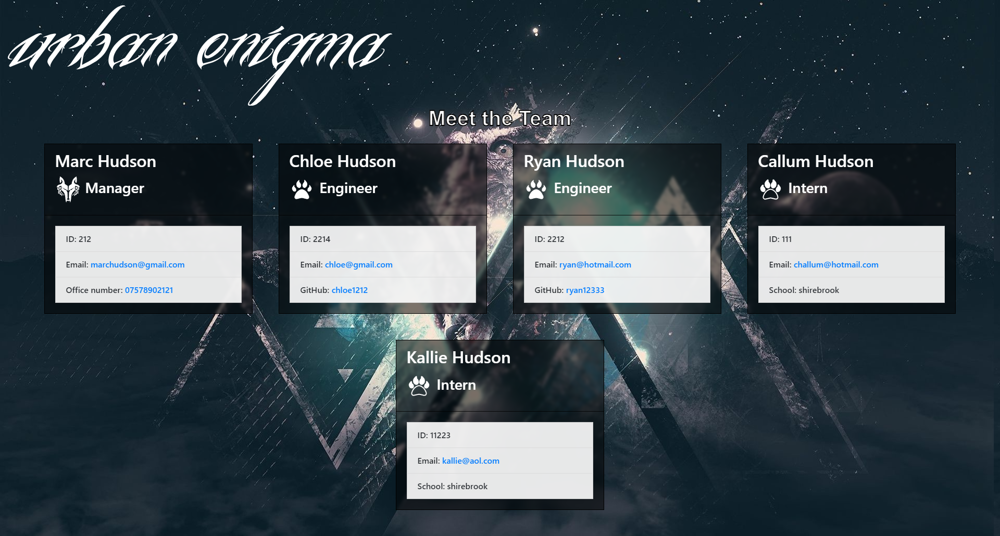

# urban enigma team generator

## Table of Contents
* [Description of application](#description)
* [Installation instructions](#installation)
* [Usage of application](#usage)


* [Application Tests](#tests-instructions)
* [Application contributors](#contributors)
* [Questions](#questions)
* [Link to deployed application](#link-to-deployed-application)
* [Screenshots of deployed application](#screenshots)


## Description
this project is a team generator, once the user types npm run start in the terminal they are, meet with a welcome message and a menu they must select a manager, once they have selected the manager you can change the manager at any time, they also can add interns and engineers, once happy with the selection hit save and view, it will load up the HTML in another window, feeling a bit tired? take a break be sure to save before taking a break and have fun ;)
 

## Installation
```
npm i 
```

## Usage
```
npm run start 
```
## Tests instructions
npm run test

## contributions

command-line-pong; 
this isn't my work this was made by Liam boom https://github.com/liambloom
it is a great application and its great to have it in my project 


## Questions
- Message me at: [marcahudson26](https://github.com/marcahudson26)
- Email me at: [marchudson2601@gmail.com](mailto:marchudson2601@gmail.com)


## Link to deployed application
*** fill in here ***

## Screenshots/ Videos

